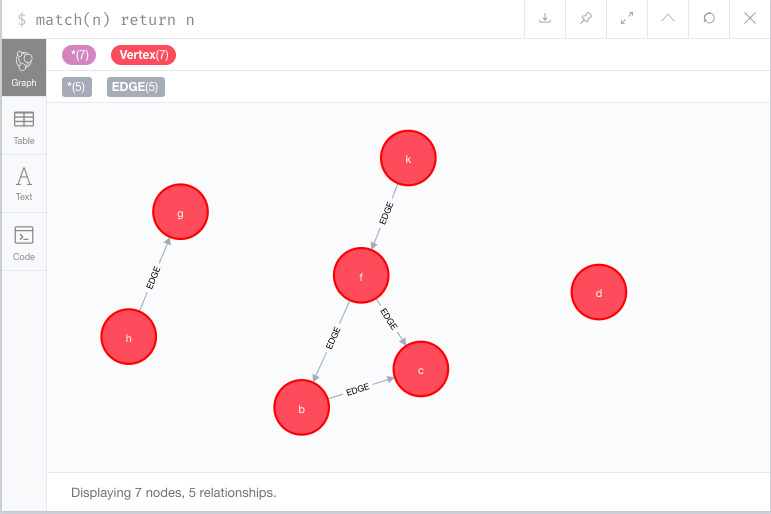

# Prolog

Work, and works, with Prolog. Explorations occur in things/. Results go into 
utils/. And we've got the P99 problemas and solutionionas in p99/

## Graph

Prolog is now uploading data to neo4j graph data store. See p99/p80 problem
set and utils/neo4j, utils/graph, and utils/cypher.

