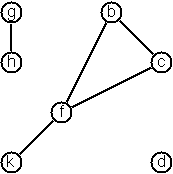
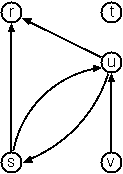
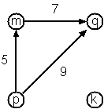
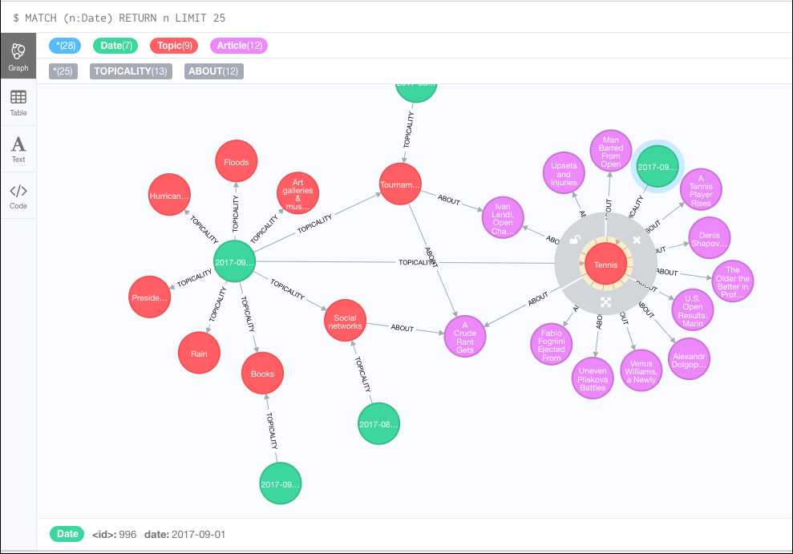

from https://www.ic.unicamp.br/~meidanis/courses/mc336/2009s2/prolog/problemas/

The original address of this page is: 

https://prof.ti.bfh.ch/hew1/informatik3/prolog/p-99/

P-99: Ninety-Nine Prolog Problems

werner.hett@bfh.ch or werner.hett@gmail.com

The purpose of this problem collection is to give you the opportunity to 
practice your skills in logic programming. Your goal should be to find the most 
elegant solution of the given problems. Efficiency is important, but logical 
clarity is even more crucial. Some of the (easy) problems can be trivially 
solved using built-in predicates. However, in these cases, you learn more if you
try to find your own solution.

Every predicate that you write should begin with a comment that describes the 
predicate in a declarative statement. Do not describe procedurally, what the 
predicate does, but write down a logical statement which includes the arguments 
of the predicate. You should also indicate the intended data types of the 
arguments and the allowed flow patterns.

The problems have different levels of difficulty. Those marked with a single 
asterisk (&lowast;) are easy. If you have successfully solved the preceeding 
problems you should be able to solve them within a few (say 15) minutes. 
Problems marked with two asterisks (&lowast;&lowast;) are of intermediate 
difficulty. If you are a skilled Prolog programmer it shouldn't take you more 
than 30-90 minutes to solve them. Problems marked with three asterisks 
(&lowast;&lowast;&lowast;) are more difficult. You may need more time (i.e. a 
few hours or more) to find a good solution.

note: the solutions provided here are implemented in Paul Tarau's
[bin prolog](https://github.com/ptarau/binprolog).

## Sections

### Working with Prolog lists p01 - p28

A list is either empty or it is composed of a first element (head) and a tail, 
which is a list itself. In Prolog we represent the empty list by the atom `[]`
and a non-empty list by a term `[H|T]` where `H` denotes the head and `T` 
denotes the tail.

### Arithmetic p31 - p41

### Logic and Codes p46 - p50

### Binary Trees p54 - p69
> (problems p58-p61 I consider answered by [utils/avl](https://github.com/geophf/logic-programming/blob/master/prolog/utils/avl.pl))

A binary tree is either empty or it is composed of a root element and two 
successors, which are binary trees themselves.

In Prolog we represent the empty tree by the atom `nil` and the non-empty tree 
by the term `t(X,L,R)`, where `X` denotes the root node and `L` and `R` denote 
the left and right subtree, respectively. The example tree depicted opposite is 
therefore represented by the following Prolog term:

```
        (a)
       /   \
    (b)     (c)
   /   \       \
(d)     (e)     (f)
               /
            (g)
```

`T1 = t(a,t(b,t(d,nil,nil),t(e,nil,nil)),t(c,nil,t(f,t(g,nil,nil),nil)))`

Other examples are a binary tree that consists of a root node only:

`T2 = t(a,nil,nil)` or an empty binary tree: `T3 = nil`

You can check your predicates using these example trees. They are given as 
test cases in p54.

### Multiway Trees p70 - p73

A multiway tree is composed of a root element and a (possibly empty) set of 
successors which are multiway trees themselves. A multiway tree is never 
empty. The set of successor trees is sometimes called a forest.

In Prolog we represent a multiway tree by a term `t(X,F)`, where `X` denotes 
the root node and `F` denotes the forest of successor trees (a Prolog list). 
The example tree depicted opposite is therefore represented by the following 
Prolog term:

```
    (a)
   / | \
(f) (c) (b)
 |      / \
(g)   (d) (e)
```

`T = t(a,[t(f,[t(g,[])]),t(c,[]),t(b,[t(d,[]),t(e,[])])])`

### Graphs p80 -

A graph is defined as a set of nodes and a set of edges, where each edge is a 
pair of nodes.

There are several ways to represent graphs in Prolog. One method is to 
represent each edge separately as one clause (fact). In this form, the graph 
depicted below is represented as the following predicate:



```PROLOG
edge(h,g).
edge(k,f).
edge(f,b).
...
```

We call this *edge-clause form*. Obviously, isolated nodes cannot be 
represented. Another method is to represent the whole graph as one data object. 
According to the definition of the graph as a pair of two sets (nodes and 
edges), we may use the following Prolog term to represent the example graph:

`graph([b,c,d,f,g,h,k],[e(b,c),e(b,f),e(c,f),e(f,k),e(g,h)])`

We call this *graph-term form*. Note, that the lists are kept sorted, they are 
really *sets*, without duplicated elements. Each edge appears only once in the 
edge list; i.e. an edge from a node `x` to another node `y` is represented as 
`e(x,y)`, the term `e(y,x)` is not present. **The graph-term form is our 
default representation.** In SWI-Prolog there are predefined predicates to work 
with sets.

A third representation method is to associate with each node the set of nodes 
that are adjacent to that node. We call this the *adjacency-list form*. In our 
example:

`[n(b,[c,f]), n(c,[b,f]), n(d,[]), n(f,[b,c,k]), ...]`

The representations we introduced so far are Prolog terms and therefore 
well-suited for automated processing, but their syntax is not very 
user-friendly. Typing the terms by hand is cumbersome and error-prone. We can 
define a more compact and "human-friendly" notation as follows: A graph is 
represented by a list of atoms and terms of the type `X-Y` (i.e. functor '`-`' 
and arity 2). The atoms stand for isolated nodes, the `X-Y`-terms describe 
edges. If an `X` appears as an endpoint of an edge, it is automatically defined 
as a node. Our example could be written as:

`[b-c, f-c, g-h, d, f-b, k-f, h-g]`

We call this the *human-friendly form*. As the example shows, the list does not 
have to be sorted and may even contain the same edge multiple times. Notice the 
isolated node `d`. (Actually, isolated nodes do not even have to be atoms in 
the Prolog-sense, they can be compound terms, as in `d(3.75,blue)` instead of 
`d` in the example).

When the edges are *directed* we call them *arcs*. These are represented by 
*ordered* pairs. Such a graph is called **directed graph**. To represent a 
directed graph, the forms discussed above are slightly modified. The example 
graph opposite is represented as follows:



*Arc-clause form*
```PROLOG
arc(s,u).
arc(u,r).
...
```

*Graph-term form*
`digraph([r,s,t,u,v],[a(s,r),a(s,u),a(u,r),a(u,s),a(v,u)])`

*Adjacency-list form*
`[n(r,[]),n(s,[r,u]),n(t,[]),n(u,[r]),n(v,[u])]`
Note that the adjacency-list does not have the information on whether it is a 
graph or a digraph.

*Human-friendly form*
`[s > r, t, u > r, s > u, u > s, v > u]`

Finally, graphs and digraphs may have additional information attached to nodes 
and edges (arcs). For the nodes, this is no problem, as we can easily replace 
the single character identifiers with arbitrary compound terms, such as 
`city('London',4711)`. On the other hand, for edges we have to extend our 
notation. Graphs with additional information attached to edges are called 
**labelled graphs.**



*Arc-clause form*
```PROLOG
arc(m,q,7).
arc(p,q,9).
arc(p,m,5).
```

*Graph-term form*
`digraph([k,m,p,q],[a(m,p,7),a(p,m,5),a(p,q,9)])`

*Adjacency-list form*
`[n(k,[]),n(m,[q/7]),n(p,[m/5,q/9]),n(q,[])]`
Notice how the edge information has been packed into a term with functor '`/`' 
and arity 2, together with the corresponding node.

*Human-friendly form*
`[p>q/9, m>q/7, k, p>m/5]`

The notation for labelled graphs can also be used for so-called 
**multi-graphs**, where more than one edge (or arc) are allowed between two 
given nodes.

### Graph Databases



This begs the question for me: certainly, we can represent graph data, and 
perform analytics on those data entirely in Prolog. But why not use a graph
database, e.g.: [neo4j](https://neo4j.com/)?

This being the case, we can do all the above problems by translating Prolog
terms to a graph representation (Cypher), uploading those data sets to the
graph database, then read the results from the graph database REST endpoint.

*Whew!* That'll be something!

* The article 
[http_json.pl](https://eu.swi-prolog.org/pldoc/doc/_SWI_/library/http/http_json.pl)
may be an insight into querying a JSON endpoint... *WITH JSON!*
* Also see
[http_open.pl](https://eu.swi-prolog.org/pldoc/doc_for?object=http_open%3Ahttp_open/3)
for connecting to a REST endpoint with username/password and POSTing data.
* Also there is a CSV endpoint and SPARQL endpoint reader in `data_source/2`
available at ... well, I don't know where the documentation is for this!

The story thus far is chronicled in [things/04_REST_endpoint.pl](https://github.com/geophf/logic-programming/blob/master/prolog/things/04_REST_endpoint.pl).
