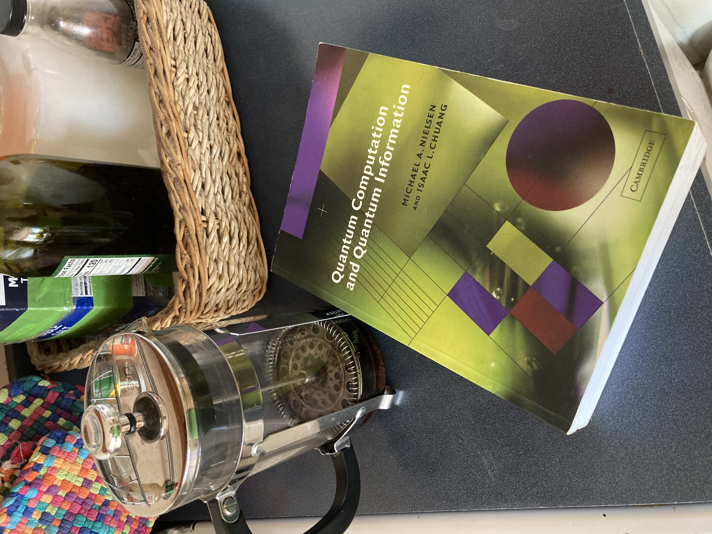

# Quantum Computation

*"A funny thing happened to me on the way to the Forum..."*

So, there I was - *walkin' heahe* - when this book - **BAM!** - hits me,
upside the head!??!? 

So, what do I do, besides sue the bejeezis out of
every company known to man, like any red-blooded American would?

I reads me the book, that's what I do!

So, IBM/HAL-9000 has a [public API](https://quantum-computing.ibm.com/) to (a 
subset of) their [quantum computer](https://www.ibm.com/quantum-computing/),
let's see if we can build a system to talk to this thing and start flippin'
stocks and houses and, idk, ... piranha fish, ... *LIKE A BOSS!*

We're going to go for a Prolog implementation. IBM provides Jupyter notebooks
with Python bindings, called [Qiskit](https://qiskit.org/) (?) (whatever). We'll
start with that, then see where Prolog fits in.

And all this in support of a presentation I'm giving. On Friday. No pressure.
