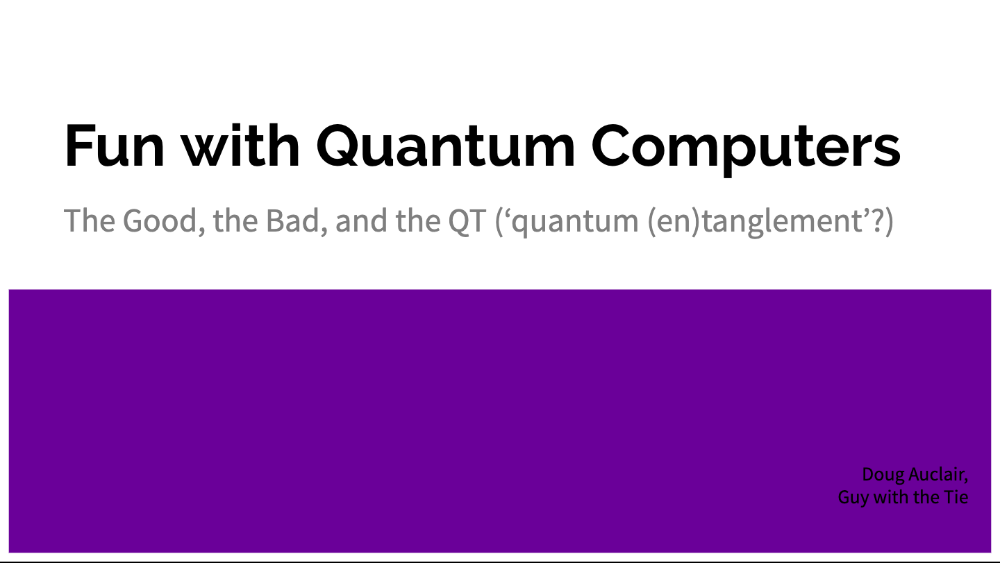
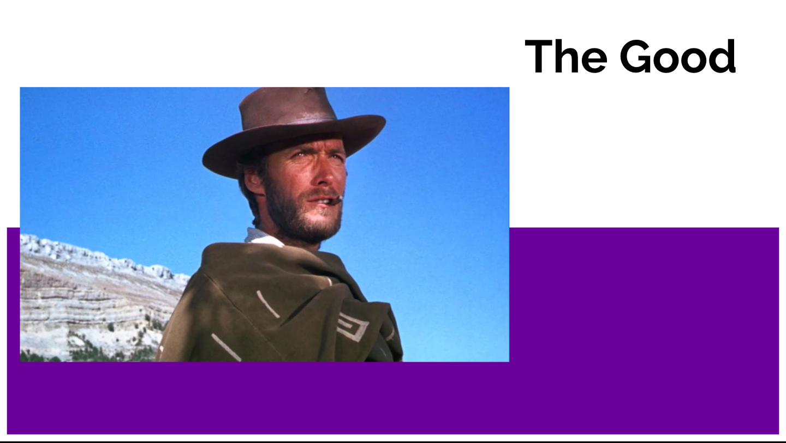
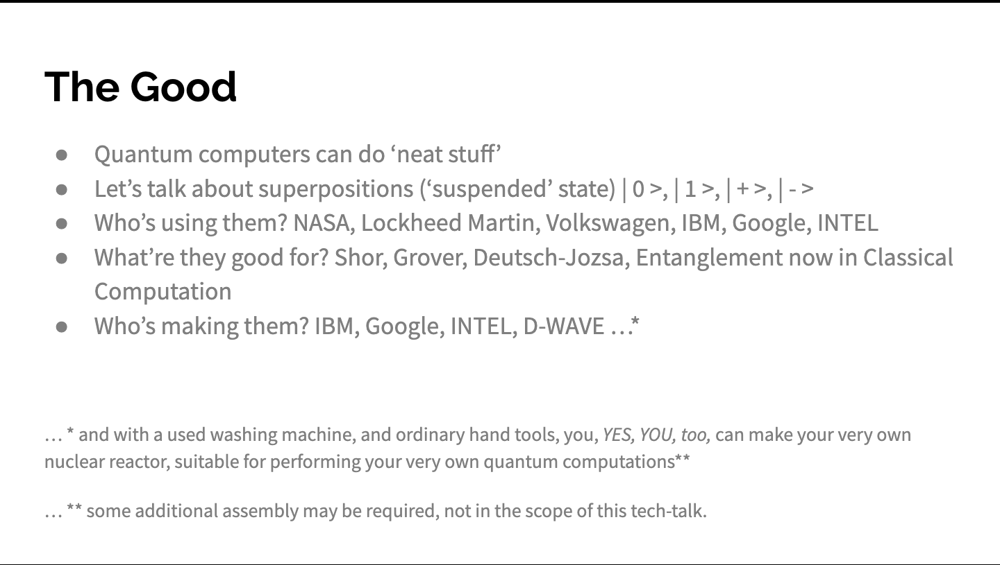
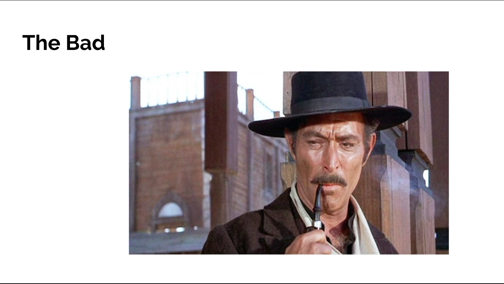
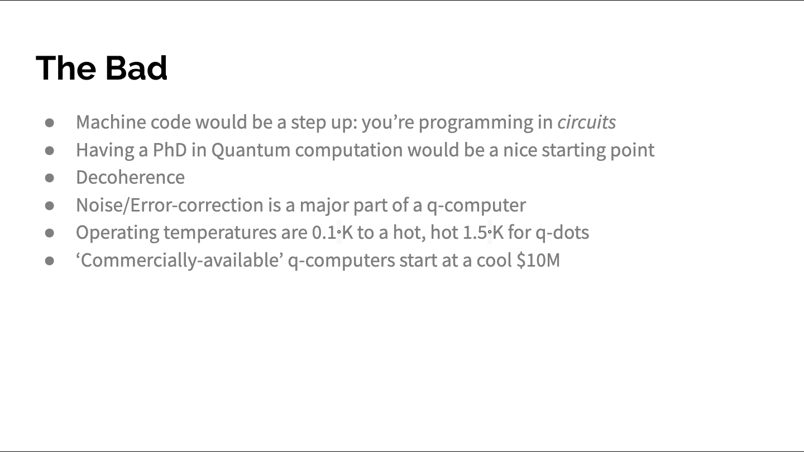
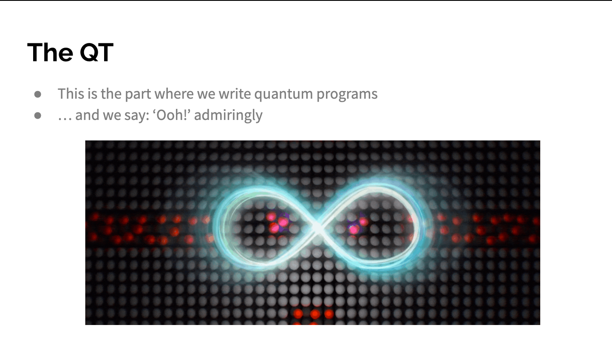
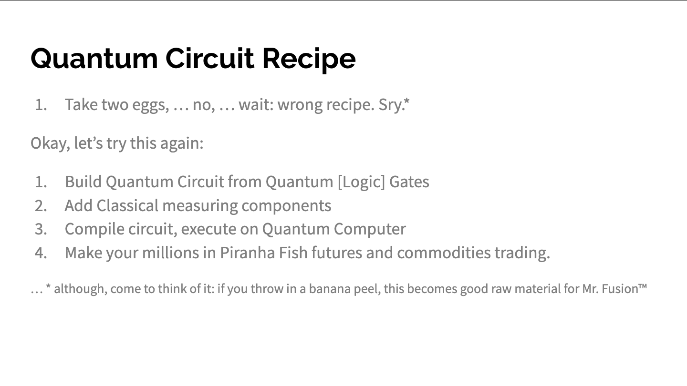
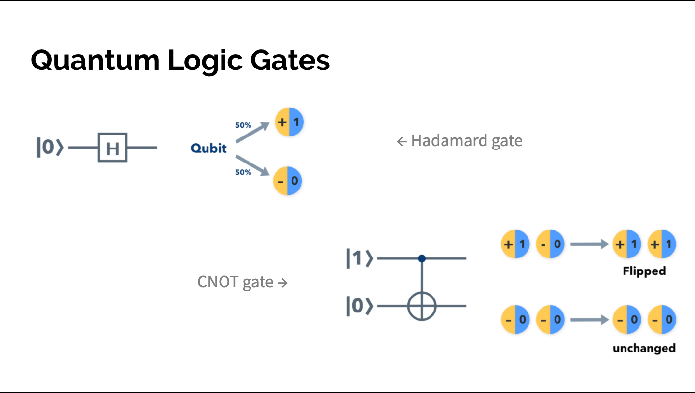
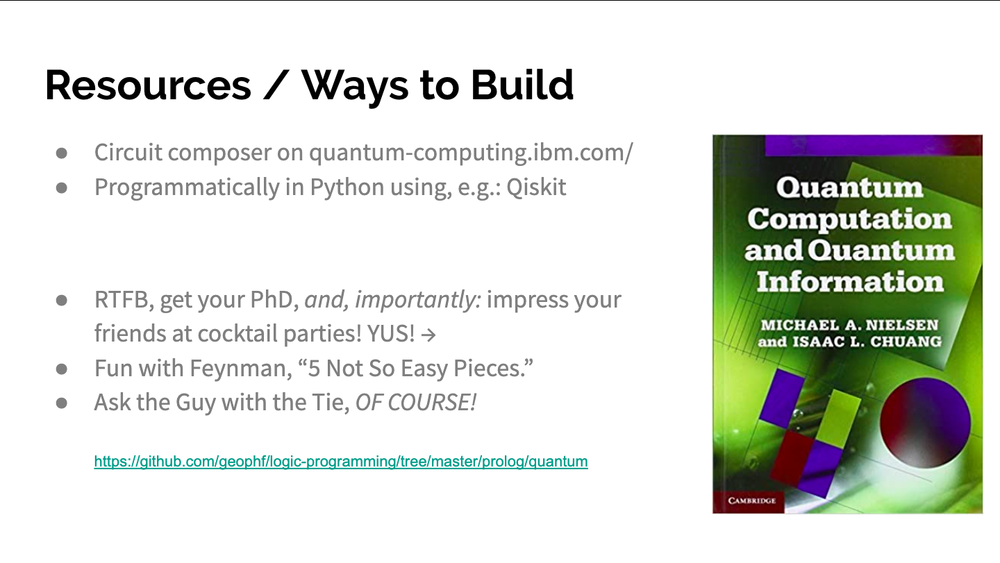

# Fun with Quantum Computers
## The Good, the Bad, and the QT (‘quantum (en)tanglement’?)

* Quantum computers can do ‘neat stuff’
* Let’s talk about superpositions (‘suspended’ state) 
> `| 0 >, | 1 >, | + >, | - >`
* Who’s using them? NASA, Lockheed Martin, Volkswagen, IBM, Google, INTEL
* What’re they good for? Shor, Grover, Deutsch-Jozsa, Entanglement now in 
  Classical Computation
* Who’s making them? IBM, Google, INTEL, D-WAVE …(1)

> … (1) and with a used washing machine, and ordinary hand tools, you, YES, YOU,
too, can make your very own nuclear reactor, suitable for performing your very 
own quantum computations (2)

> … (2) some additional assembly may be required, not in the scope of this 
tech-talk.

* Machine code would be a step up: you’re programming in circuits
* Having a PhD in Quantum computation would be a nice starting point
* Decoherence
* Noise/Error-correction is a major part of a q-computer
* Operating temperatures are 0.1°K to a hot, hot 1.5°K for q-dots
* ‘Commercially-available’ q-computers start at a cool $10M

Awwww <3 

This is the part where we write quantum programs
… and we say: ‘Ooh!’ admiringly

1. Take two eggs, … no, … wait: wrong recipe. Sry. (a)

Okay, let’s try this again:

1. Build Quantum Circuit from Quantum [Logic] Gates
2. Add Classical measuring components
3. Compile circuit, execute on Quantum Computer
4. Make your millions in Piranha Fish futures and commodities trading.

> … (a) although, come to think of it: if you throw in a banana peel, this 
becomes good raw material for Mr. Fusion™

* Circuit composer on quantum-computing.ibm.com/
* Programmatically in Python using, e.g.: Qiskit

* RTFB, get your PhD, and, importantly: impress your friends at cocktail 
parties! YUS!
* Fun with Feynman, “5 Not So Easy Pieces.”
* Ask the Guy with the Tie, OF COURSE!
  https://github.com/geophf/logic-programming/tree/master/prolog/quantum
