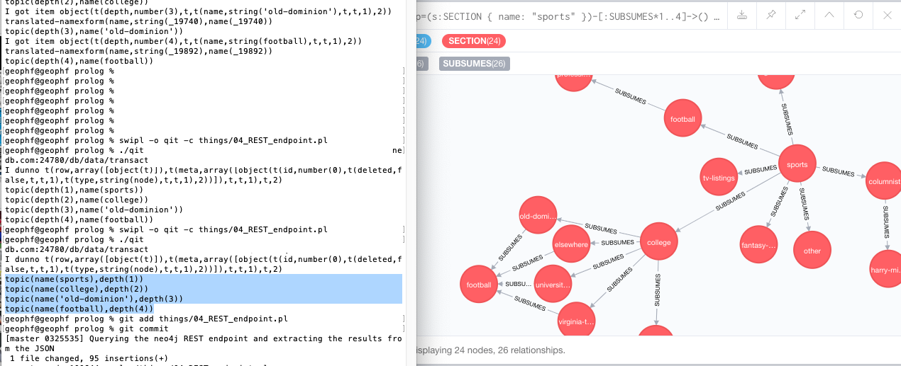

# "things"

So, these are some ... "things" that I just need to build systems.

Ya know: 'readin, 'ritin, and 'rithmetic.

I pose these "things" I need to do as a series of problems to solve.

---

Got one of the things done: 04_REST_endpoint POSTs JSON to a REST endpoint,
then translates the response JSON to Prolog terms. That the REST endpoint is
a neo4j graph database on the cloud is icing on the KĀKË!

